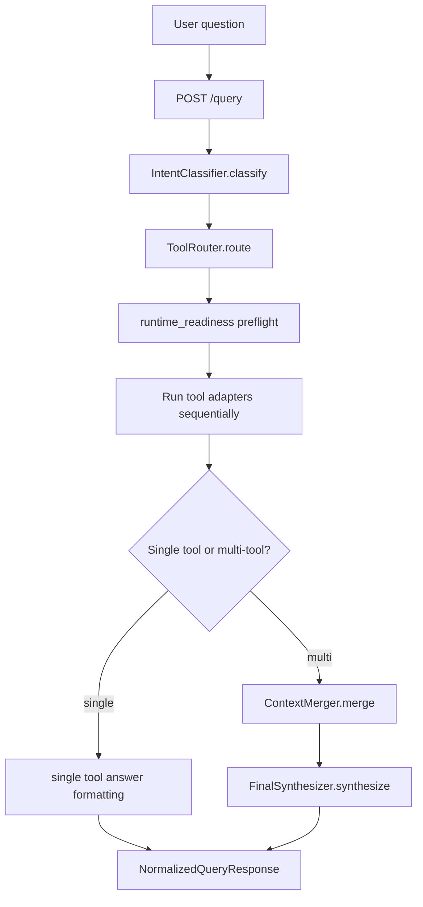
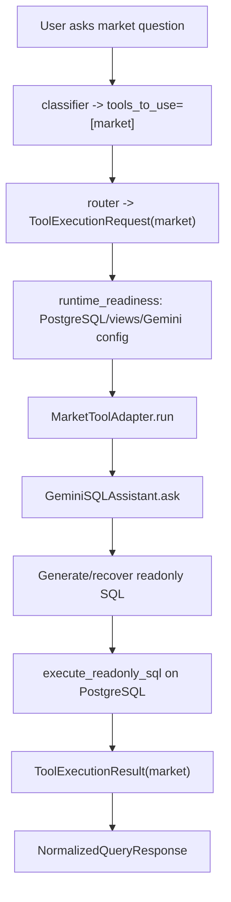
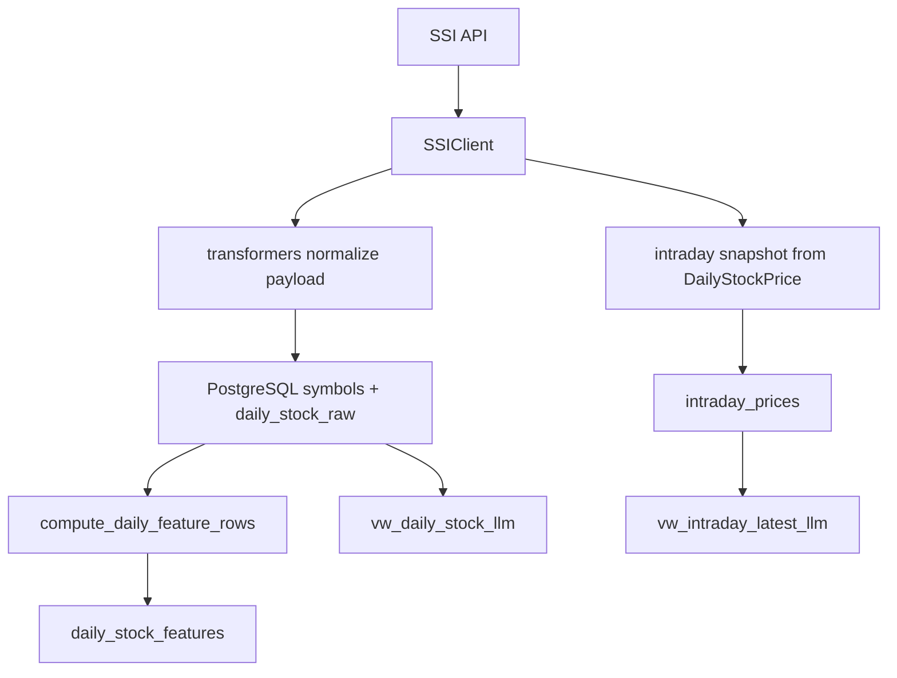
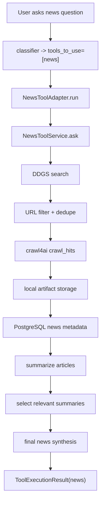
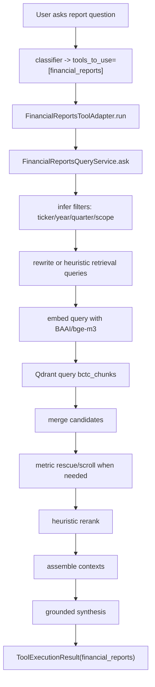
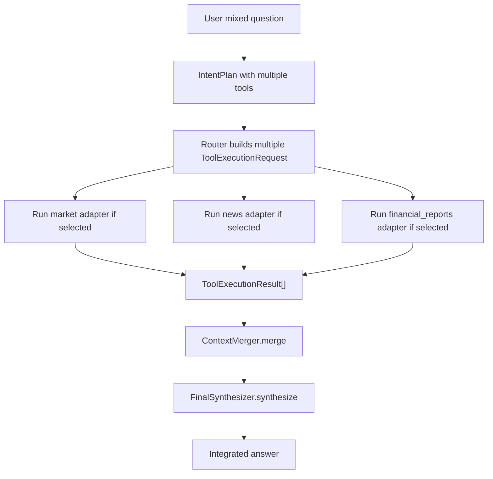
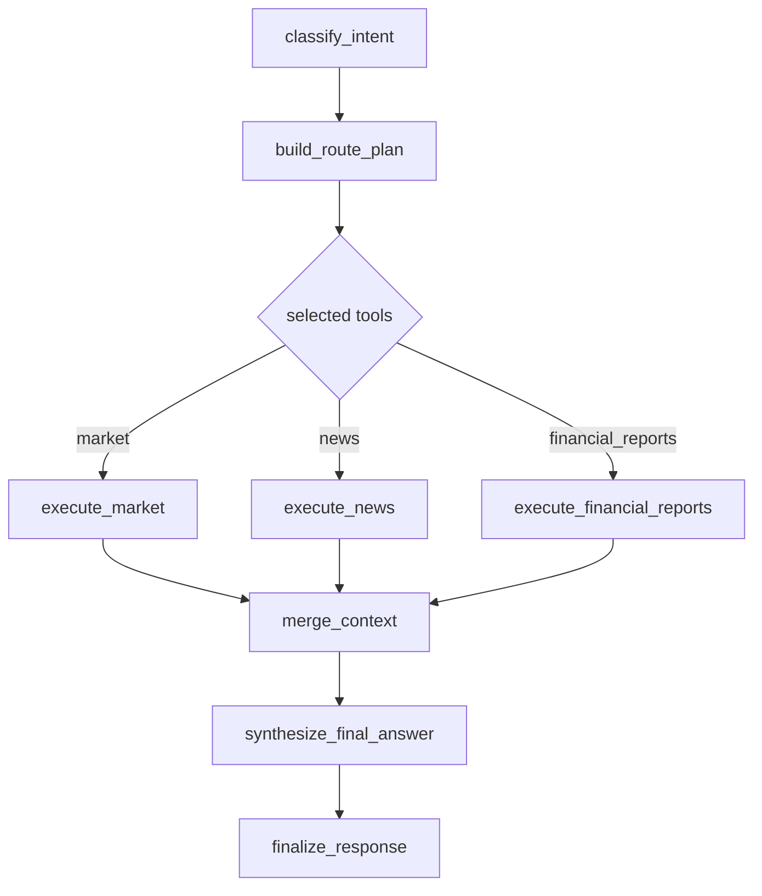

# AI Project Handover: ETL_Market_Data

Tài liệu này là file handover chính cho repo:

```text
D:\AI_Stock\DataPlatforms\ETL_Market_Data
```

Mục tiêu là để một người hoặc AI khác đọc một file này là hiểu dự án đang làm gì, thư mục nào quan trọng, luồng xử lý đi qua đâu, database lưu gì, stack công nghệ nào đang dùng, tối ưu hiện tại ra sao, và đâu là hướng tối ưu/LangGraph để tham khảo về sau.

Source of truth chính vẫn là code trong repo. GitNexus đã được dùng để đối chiếu call graph, đặc biệt quanh `stock_etl.orchestration.orchestration_api.execute_query`; tuy nhiên index `DataPlatforms` đang stale nhẹ 1 commit, nên khi có khác biệt thì ưu tiên code hiện tại trong thư mục này.

## 1. Dự Án Này Là Gì

`ETL_Market_Data` là hệ thống ETL và hỏi đáp dữ liệu chứng khoán/tài chính cho thị trường Việt Nam. Repo gồm bốn phần lớn:

| Phần | Vai trò | Runtime chính |
| --- | --- | --- |
| Market ETL | Lấy dữ liệu SSI, chuẩn hóa, lưu PostgreSQL, tính chỉ báo kỹ thuật | `src/stock_etl/pipeline.py`, `database.py`, `transformers.py`, `ssi_client.py` |
| Market QA | Trả lời câu hỏi giá/lịch sử/technical bằng NL2SQL và fallback SQL | `src/stock_etl/nl2sql.py`, `api.py`, `orchestration/market_adapter.py` |
| News Tool | Tìm tin, crawl bài, lưu artifact, tóm tắt tin liên quan | `src/stock_etl/news_tool` |
| Financial Reports Tool | Retrieval báo cáo tài chính từ Qdrant, rerank và synthesize câu trả lời grounded | `src/stock_etl/financial_reports_tool` |

Lớp runtime mới nhất là FastAPI orchestration. Người dùng gửi câu hỏi tự nhiên vào `/query`, hệ thống classify intent, route sang một hoặc nhiều tool, chạy tool, gom evidence, rồi trả response chuẩn hóa.

Luồng tổng quát hiện tại:



Quan trọng: implementation hiện tại là registry-based/sequential orchestration, chưa dùng LangGraph. LangGraph chỉ là kiến trúc mục tiêu nằm ở phụ lục cuối file.

## 2. Bản Đồ Thư Mục

| Path | Vai trò | Nên đọc khi |
| --- | --- | --- |
| `src/stock_etl` | Source runtime chính cho market, orchestration, news, financial reports | Cần hiểu hoặc sửa logic |
| `tests` | Test cho orchestration, news, reports, key pools, NL2SQL fallback | Cần xác nhận behavior |
| `dags` | Airflow DAG cho market ETL | Cần hiểu backfill, intraday, EOD |
| `scripts` | Script boot dev stack, restore dump, smoke test, sync parsed output | Cần vận hành local/dev |
| `docs` | Tài liệu handover và các bản đồ riêng | Cần đọc/bàn giao |
| `exports` | Dump dữ liệu market để restore PostgreSQL local/dev | Cần seed database |
| `data` | Local data copy, có thể gồm parsed reports từ `D:\LandingAI` | Cần debug report source/dev ingest |
| `news_artifacts` | Artifact crawl news: raw html, payload, cleaned text, article markdown | Debug news crawl/storage |
| `logs`, `tmp` | Runtime state/log tạm | Debug local, không xem là source |
| `docker-compose.dev.yml` | Dev stack tối thiểu: PostgreSQL, Qdrant, orchestration API, Adminer | Chạy local/dev |
| `docker-compose.yml` | Stack cũ/full hơn cho market ETL/Airflow/API | Chạy Airflow/ETL market |
| `requirements.txt` | Python dependencies runtime | Thêm/sửa dependency |

Thư mục quan trọng nhất là:

```text
src\stock_etl
```

Trong đó:

| Khu vực | Path | Chức năng |
| --- | --- | --- |
| Core market | `src/stock_etl/*.py` ở root package | SSI ETL, schema, NL2SQL, API cũ, CLI |
| Orchestration | `src/stock_etl/orchestration` | Classifier, router, adapters, readiness, merger, final answer, trace, UI |
| News tool | `src/stock_etl/news_tool` | Search/crawl/store/summarize/persist news |
| Financial reports tool | `src/stock_etl/financial_reports_tool` | Qdrant retrieval, embedding, rerank, synthesis |
| Market web UI cũ | `src/stock_etl/web` | UI cho `/ask` legacy market API |

## 3. Stack Công Nghệ

| Layer | Công nghệ |
| --- | --- |
| Language/runtime | Python |
| Web API | FastAPI, Uvicorn |
| ORM/DB access | SQLAlchemy 1.4, psycopg2 |
| Relational DB | PostgreSQL 16 |
| Vector DB | Qdrant 1.14.x |
| Embedding | `sentence-transformers`, mặc định `BAAI/bge-m3` |
| LLM | Google Gemini, Groq |
| Search/news | DDGS/DuckDuckGo, crawl4ai |
| ETL scheduler | Airflow DAGs |
| Data processing | pandas, numpy |
| Local/dev runtime | Docker Compose |
| DB UI | Adminer |

Dev stack chính trong `docker-compose.dev.yml`:

| Service | Container | Host port | Vai trò |
| --- | --- | --- | --- |
| `postgres` | `ssi-postgres-dev` | `15432 -> 5432` | Market data và news metadata |
| `qdrant` | `ssi-qdrant-dev` | `6333`, `6334` | Vector DB cho financial reports |
| `orchestration-api` | `ssi-orchestration-api-dev` | `8001` | FastAPI orchestration |
| `adminer` | `ssi-adminer-dev` | `18081` | Xem PostgreSQL |

Entrypoint orchestration dev:

```text
uvicorn stock_etl.orchestration.orchestration_api:app --host 0.0.0.0 --port 8001
```

## 4. Entrypoints Và Public Contracts

### FastAPI orchestration

File chính:

```text
src/stock_etl/orchestration/orchestration_api.py
```

Endpoint:

| Endpoint | Vai trò |
| --- | --- |
| `GET /health` | Health check orchestration |
| `GET /`, `GET /ui` | UI test orchestration |
| `POST /classify` | Chỉ classify request, chưa chạy tool |
| `POST /query` | Endpoint runtime chính |
| `POST /debug/run-tools` | Chạy full flow với `debug=true` |

GitNexus context xác nhận `execute_query` được gọi từ `/query` và `/debug/run-tools`. Hàm này là lõi của runtime hiện tại.

### Legacy market API

File:

```text
src/stock_etl/api.py
```

Endpoint:

| Endpoint | Vai trò |
| --- | --- |
| `GET /health` | Health check API cũ |
| `GET /`, `GET /ui` | UI market QA cũ |
| `POST /ask` | Legacy market NL2SQL QA |

`/ask` cần được giữ backward-compatible nếu refactor orchestration.

### Orchestration contracts

File:

```text
src/stock_etl/orchestration/contracts.py
```

| Contract | Vai trò |
| --- | --- |
| `ToolName` | Enum tool đã biết: `market`, `news`, `financial_reports` |
| `ToolExecutionStatus` | Trạng thái tool: `success`, `no_data`, `error`, `skipped`, `not_supported_yet` |
| `NormalizedQueryRequest` | Request đầu vào cho orchestration |
| `IntentPlan` | Kết quả classifier trước khi route |
| `ToolExecutionRequest` | Request đã gán cho một tool |
| `ToolExecutionResult` | Kết quả chuẩn hóa của một tool |
| `DebugTrace` | Trace debug toàn flow |
| `NormalizedQueryResponse` | Response top-level của orchestration API |

Nếu thêm tool mới, tool đó nên có adapter trả về `ToolExecutionResult`, và đi qua router/orchestrator thay vì gọi route handler nội bộ.

## 5. Luồng Xử Lý `/query` Hiện Tại

Hàm lõi:

```text
src/stock_etl/orchestration/orchestration_api.py::execute_query
```

Trình tự thực tế:

1. Tạo `TraceCollector` và ghi event `request.received`.
2. Gọi `IntentClassifier.classify(request)` để tạo `IntentPlan`.
3. Gọi `ToolRouter` để lấy requested tools, unsupported tools, và danh sách `ToolExecutionRequest`.
4. Ghi trace về tool requested/chosen/unsupported.
5. Gọi `build_runtime_readiness_map` cho các tool sẽ chạy.
6. Với từng tool request, nếu readiness runtime fail thì tạo preflight `ToolExecutionResult` error và bỏ qua adapter.
7. Nếu ready, chạy adapter theo thứ tự router trả về: market, news, financial reports.
8. Thêm result `not_supported_yet` cho tool đã detect nhưng runtime chưa support.
9. Resolve top-level status bằng `_resolve_response_status`.
10. Nếu có nhiều tool thành công, dùng `ContextMerger.merge` và `FinalSynthesizer.synthesize`.
11. Nếu single-tool hoặc không đủ điều kiện synthesize, format answer từ summary của tool.
12. Trả `NormalizedQueryResponse`, kèm `debug_trace` nếu request bật debug.

Status top-level:

| Status | Ý nghĩa |
| --- | --- |
| `success` | Tất cả phần cần thiết thành công |
| `partial_success` | Ít nhất một tool thành công, nhưng có tool fail/no_data/not_supported |
| `no_data` | Tool chạy được nhưng không có dữ liệu phù hợp |
| `partial_no_data` | Mixed query có nhánh không có dữ liệu |
| `error` | Lỗi runtime/dependency/tool |
| `not_supported_yet` | Intent nhận ra nhưng runtime chưa hỗ trợ đủ |
| `no_route` | Classifier/router không chọn được tool phù hợp |

## 6. Nhánh Market

Tool `market` trả lời câu hỏi về giá hiện tại, giá lịch sử, so sánh giá theo ngày/tháng/năm, volume, foreign flow, market cap và chỉ báo kỹ thuật.

| File | Trách nhiệm | Rủi ro khi sửa |
| --- | --- | --- |
| `config.py` | Load env/settings, DB URL, SSI credentials, LLM keys, tracked symbols | Rất cao |
| `database.py` | DDL, views, partition, migration, upsert, readonly SQL | Rất cao |
| `models.py` | SQLAlchemy ORM models cho market tables | Cao |
| `pipeline.py` | Business workflows: backfill, intraday refresh, finalize EOD | Cao |
| `ssi_client.py` | Gọi SSI API, token handling | Cao |
| `transformers.py` | Chuẩn hóa payload SSI thành row/model data, tính feature rows | Cao |
| `nl2sql.py` | Gemini/heuristic sinh SQL readonly và local answer | Cao |
| `api.py` | Legacy FastAPI `/ask` | Trung bình-cao |
| `cli.py` | CLI init-db, backfill, refresh, finalize, ask | Trung bình |
| `gemini_pool.py` | Multi-key Gemini retry/pool | Trung bình |
| `groq_pool.py` | Multi-key Groq retry/pool | Trung bình |
| `symbols.py` | Symbol metadata/list helpers | Thấp-trung bình |

Market-only flow:



Nguồn query ưu tiên:

| Nguồn | Dùng khi |
| --- | --- |
| `vw_daily_stock_llm` | Historical, technical, so sánh nhiều ngày |
| `vw_intraday_latest_llm` | Giá hiện tại, mới nhất, trong ngày |
| `daily_stock_raw`, `daily_stock_features`, `intraday_prices` | Bảng nền, phục vụ view và debug |

Failure branches:

| Branch | Behavior |
| --- | --- |
| Gemini fail/quota | `nl2sql.py` có heuristic fallback nếu match được pattern |
| SQL unsafe | SQL validator reject, chỉ cho phép read-only safe query |
| Postgres/views missing | readiness trả dependency diagnostic |
| No rows | `ToolExecutionResult.status = no_data` |

Market ETL flow:



Workflows trong `pipeline.py`:

| Function | Vai trò |
| --- | --- |
| `bootstrap_history` | Backfill lịch sử từ `BOOTSTRAP_START_DATE` đến end date; refresh profile; upsert raw; recompute features |
| `refresh_intraday_session` | Micro-batch trong phiên; lấy snapshot ngày hiện tại từ SSI `DailyStockPrice`; upsert `intraday_prices` |
| `finalize_end_of_day` | Chốt EOD; ghi raw ngày; recompute features; cleanup intraday cũ |

Airflow DAGs:

| DAG | Schedule | Vai trò |
| --- | --- | --- |
| `ssi_bootstrap_history` | Manual | Backfill lịch sử |
| `ssi_intraday_session_main` | `*/2 9-14 * * 1-5` | Refresh intraday mỗi 2 phút từ 09:00 đến 14:58 thứ 2-6 |
| `ssi_intraday_session_close` | `10 15 * * 1-5` | Chốt phiên sau giờ giao dịch |

## 7. Nhánh News

Tool `news` trả lời câu hỏi tin tức gần đây. Đây là nhánh phụ thuộc live web nên latency và kết quả có thể dao động theo thời điểm.

| File | Trách nhiệm |
| --- | --- |
| `news_tool/config.py` | Settings: sites, top N, artifact root, provider/model |
| `news_tool/schemas.py` | News request/result/article schemas |
| `news_tool/search.py` | DDGS/DuckDuckGo search, trusted sites, URL filtering |
| `news_tool/crawler.py` | crawl4ai crawl URL, fallback snippets |
| `news_tool/storage.py` | Local artifact storage, URL/content hash |
| `news_tool/database.py` | PostgreSQL schema và CRUD metadata news |
| `news_tool/summarizer.py` | Per-article và final summaries bằng Groq/Gemini |
| `news_tool/service.py` | End-to-end search -> crawl -> persist -> summarize |
| `news_tool/api.py` | Optional standalone news API |

News-only flow:



Failure branches:

| Branch | Behavior |
| --- | --- |
| Search no hits | `no_data`, limitation ghi DDGS không trả kết quả |
| Một số link crawl fail | Continue các bài khác, có thể dùng snippet/nội dung rút gọn |
| Tất cả link fail | `no_data` hoặc `error` tùy lỗi |
| Không bài nào bám sát entity | `no_data`, loại các bài ít liên quan |
| Summarizer/model fail | `error` hoặc fallback theo path implementation |
| Postgres missing | readiness block news vì metadata storage là dependency |

## 8. Nhánh Financial Reports

Tool `financial_reports` trả lời câu hỏi về báo cáo tài chính, đặc biệt các câu hỏi cần truy xuất dòng bảng, cột kỳ báo cáo, metric tại ngày/cuối kỳ.

Runtime query không đọc Markdown trực tiếp. Query thật đi qua Qdrant collection:

```text
bctc_chunks
```

Source data parsed/ingest có thể đến từ repo ngoài:

```text
D:\LandingAI
```

`D:\LandingAI\parsed_output` là nguồn dev/ingest, còn runtime trong repo này cần Qdrant đã có data.

| File | Trách nhiệm |
| --- | --- |
| `financial_reports_tool/config.py` | Qdrant, embedding, Groq settings |
| `financial_reports_tool/schemas.py` | Public response/hit/context schemas |
| `runtime/contracts.py` | Internal filters, query plan, candidate contracts |
| `runtime/retrieval.py` | Infer filters, build query plan/filter, assemble contexts |
| `runtime/rerank.py` | Heuristic rerank cho report chunks/table rows |
| `runtime/synthesis.py` | Rewrite query và synthesize grounded answer |
| `runtime/query_service.py` | End-to-end report query pipeline |
| `shared/embedding.py` | SentenceTransformer/BGE wrapper |
| `shared/qdrant_store.py` | Qdrant search/scroll abstraction |
| `shared/chunking_profiles.py` | Scoring/profile constants |

Financial-reports-only flow:



Failure branches:

| Branch | Behavior |
| --- | --- |
| Qdrant down | readiness/service error |
| Collection missing | dependency diagnostic |
| No relevant chunks | `no_data` |
| LLM rewrite unavailable | Fallback về heuristic retrieval queries |
| Groq synthesis fail | Có thể dùng deterministic/fallback path nếu implementation support |
| Context không đủ evidence | `no_data` hoặc limitation "context chưa đủ evidence" |

## 9. Multi-tool Flow

Multi-tool dùng khi câu hỏi cần nhiều nguồn cùng lúc, ví dụ:

- `market + news`: giá hiện tại và tin gần đây.
- `market + financial_reports`: giá hiện tại và số liệu BCTC.
- `market + news + financial_reports`: market context, tin tức, và số liệu báo cáo.

Flow:



Cần nhớ:

- Hiện tại tool execution trong `execute_query` là tuần tự, không song song.
- Multi-tool answer không nên chỉ concat summary; code có `ContextMerger` và `FinalSynthesizer` để tạo câu trả lời hợp nhất.
- `results[]` vẫn giữ từng tool result để audit/debug.
- Nếu một tool fail/no_data nhưng tool khác success, top-level thường là `partial_success`.

## 10. Database Và Storage

### PostgreSQL market

Schema chính nằm trong:

```text
src/stock_etl/database.py
src/stock_etl/models.py
```

| Object | Loại | Nội dung | Tối ưu/ghi chú |
| --- | --- | --- | --- |
| `symbols` | table | Metadata ticker: mã, tên VI/EN, sàn, market, listed shares | Index `(exchange, market)` |
| `daily_stock_raw` | partitioned table | Dữ liệu chốt phiên raw từ SSI | Partition by `trading_date`; PK `(ticker, trading_date)` |
| `daily_stock_features` | table | Feature/technical indicators | PK `(ticker, trading_date)` |
| `intraday_prices` | table | Snapshot trong phiên theo timestamp | PK `(ticker, timestamp)` |
| `vw_daily_stock_llm` | view | Join `symbols` + daily raw + features | Nguồn chính cho historical/technical QA |
| `vw_intraday_latest_llm` | view | Snapshot mới nhất trong ngày của từng mã | Nguồn chính cho current price QA |

Cột quan trọng của `daily_stock_raw`:

- Price: `ref_price`, `ceiling_price`, `floor_price`, `open_price`, `high_price`, `low_price`, `close_price`, `avg_price`, `adj_close_price`.
- Volume/value: `matched_volume`, `matched_value`, `put_through_volume`, `put_through_value`, `total_volume`, `total_value`.
- Foreign flow: `foreign_buy_vol`, `foreign_sell_vol`, `foreign_buy_value`, `foreign_sell_value`, `foreign_room_left`, `foreign_net_vol`, `foreign_net_value`.
- Order statistics: `total_buy_orders`, `total_buy_vol`, `total_sell_orders`, `total_sell_vol`.
- Change/time: `price_change`, `price_change_pct`, `ssi_returned_at`, `system_ingested_at`.

Cột quan trọng của `daily_stock_features`:

- `snapshot_listed_shares`, `market_cap`.
- `ma20`, `ma50`, `ma200`.
- `rsi_14`, `macd`, `macd_signal`.
- `flag_above_ma50`, `flag_overbought`, `flag_oversold`.
- `formula_version`, `calculated_at`.

Lưu ý nghiệp vụ:

- `close_price` là giá raw do SSI trả về.
- `adj_close_price` là giá đã điều chỉnh.
- `vw_daily_stock_llm` tạo `effective_close_price = COALESCE(adj_close_price, close_price)` và nên ưu tiên cột này cho so sánh lịch sử, lợi suất, trend nhiều ngày.
- `intraday_prices` không phải nến phút đầy đủ. Nó là snapshot từ API `DailyStockPrice` tại mỗi lần crawl.

### PostgreSQL news

Schema nằm trong:

```text
src/stock_etl/news_tool/database.py
```

| Object | Nội dung |
| --- | --- |
| `news_queries` | Một câu hỏi/news query logical, trace, status, metadata |
| `news_runs` | Mỗi lần chạy search/crawl/summarize cho query |
| `news_articles` | Metadata từng article: URL, site, title, snippet, summary, status |
| `news_article_contents` | Raw html/markdown/cleaned text/artifact keys/extracted payload |

News cần Postgres để persist lifecycle query/run/article/content. Artifact nặng hơn nằm ở filesystem.

### Qdrant financial reports

Runtime collection mặc định:

```text
bctc_chunks
```

Payload fields quan trọng:

| Field | Ý nghĩa |
| --- | --- |
| `retrieval_id` | ID để truy xuất/log/debug |
| `document_id` | ID document/report |
| `ticker` | Mã cổ phiếu |
| `year` | Năm báo cáo |
| `quarter` | Quý |
| `period` | Kỳ như `6T` |
| `report_family` | Nhóm báo cáo, ví dụ `BCTC` |
| `report_type` | Loại báo cáo, ví dụ `Soatxet`, `Thuongnien` |
| `scope` | `Congtyme` hoặc `Hopnhat` |
| `page` | Trang trong report |
| `chunk_type` | `table_row`, `table_row_window`, `table_full`, text chunks |
| `section_title` | Tiêu đề section/bảng |
| `section_subtitle` | Subtitle nếu có |
| `raw_content` | Nội dung gốc chunk |
| `content_for_embedding` | Text dùng để embed |
| `metadata.row_label` | Label dòng bảng |
| `metadata.row_values` | Map cột -> giá trị, rất quan trọng cho table QA |

Với câu hỏi bảng số liệu, `metadata.row_values` thường là evidence quan trọng nhất.

### Local filesystem

| Path | Dùng cho |
| --- | --- |
| `news_artifacts` | Raw/crawled/cleaned news artifacts |
| `data/financial_reports/parsed_output` | Local copy từ `D:\LandingAI\parsed_output` |
| `exports/ssi_market_stock_only.dump` | Restore market PostgreSQL local/dev |
| `logs`, `tmp` | Runtime temp/log state |

Không copy nội dung `.env`, `.env.local`, `.env.docker` vào tài liệu hoặc prompt cho AI khác vì có thể có secrets.

## 11. Readiness, Debug Và Kiểm Thử

Runtime readiness nằm trong:

```text
src/stock_etl/orchestration/runtime_readiness.py
```

Nó check dependency theo tool:

| Tool | Dependency chính |
| --- | --- |
| `market` | PostgreSQL, required views/tables, Gemini config nếu cần NL2SQL |
| `news` | PostgreSQL metadata, DDGS/crawl4ai/provider config, artifact root |
| `financial_reports` | Qdrant URL/collection, embedding dependencies, provider config |

Debug trace có trong `DebugTrace`:

- requested/chosen/unsupported tools.
- fallback reason.
- generated SQL cho market nếu có.
- events với timing/metadata.
- readiness map nếu debug.
- merged context metadata nếu multi-tool.
- report retrieval queries/top hits/context metadata qua raw/tool result.

Test folders nên đọc khi sửa:

| Path | Bao phủ |
| --- | --- |
| `tests/orchestration` | Classifier, router, adapters, context merger, final synthesizer, API, readiness |
| `tests/news_tool` | Search, crawler, config, service, summarizer |
| `tests/financial_reports_tool` | Query service, retrieval, rerank, synthesis, imports |
| `tests/test_nl2sql_local_answer.py` | Market local answer/fallback |
| `tests/test_gemini_pool.py`, `tests/test_groq_pool.py` | Key pool/retry behavior |

Khi sửa user-facing flow, nên thêm/sửa test ở folder gần với behavior đó thay vì tạo test quá rộng.

## 12. Hướng Dẫn Cho AI Khác Khi Bắt Đầu

Thứ tự đọc để ít bị lạc:

1. Đọc file này trước.
2. Nếu cần sửa orchestration, đọc `src/stock_etl/orchestration/orchestration_api.py`, `contracts.py`, `intent_classifier.py`, `router.py`.
3. Nếu sai tool được chọn, đọc `intent_classifier.py`, `fallback_rules.py`, `router.py`.
4. Nếu market trả SQL/answer sai, đọc `nl2sql.py`, `database.py`, `orchestration/market_adapter.py`.
5. Nếu news trả link/tóm tắt kém, đọc `news_tool/search.py`, `crawler.py`, `summarizer.py`, `service.py`.
6. Nếu financial reports không lấy đúng dòng bảng, đọc `financial_reports_tool/runtime/retrieval.py`, `rerank.py`, `synthesis.py`, `query_service.py`.
7. Nếu mixed answer rời rạc, đọc `context_merger.py` và `final_synthesizer.py`.
8. Nếu local/dev bị block dependency, đọc `runtime_readiness.py`, `docker-compose.dev.yml`, `RUNBOOK.md`.

Những điểm không nên nhầm:

- `financial_reports` query thật qua Qdrant, không đọc Markdown trực tiếp trong runtime.
- `news` dùng live web search/crawl nên kết quả thay đổi theo thời điểm.
- `LangGraph` chưa được implement; nó là target architecture.
- Direct import adapters hiện đang nhanh và đơn giản hơn internal HTTP giữa các tool.
- `.env*` thật có thể chứa secrets, không đưa vào docs/prompt.

## 13. Tối Ưu Hiện Tại

Đây là những tối ưu đã có trong implementation/tài liệu hiện tại:

| Khu vực | Tối ưu | Tác dụng |
| --- | --- | --- |
| Market DB | `daily_stock_raw` partition by `trading_date` | Scale backfill/truy vấn lịch sử tốt hơn |
| Market DB | Index `(ticker, trading_date DESC)`, `(trading_date DESC, ticker)` | Tăng tốc query theo mã/ngày |
| Market DB | Index intraday theo `(ticker, trading_date, timestamp DESC)` | Tăng tốc latest snapshot/current price |
| Market QA | `vw_daily_stock_llm`, `vw_intraday_latest_llm` | Giảm độ phức tạp SQL cho LLM |
| Market QA | Read-only SQL validation | Giảm rủi ro LLM sinh SQL nguy hiểm |
| Orchestration | Direct import adapters | Tránh overhead internal HTTP |
| Orchestration | Dependency-aware preflight | Không block sai dependency giữa các tool |
| Orchestration | Context merger + final synthesizer | Mixed answer tốt hơn concat summary |
| News | DDGS + URL filter/dedupe | Giảm link rác trước crawl |
| News | Per-article failure isolation | Một link lỗi không làm hỏng toàn run |
| Reports | Qdrant vector retrieval | Tìm chunk report nhanh theo semantic query |
| Reports | `BAAI/bge-m3` embedding | Hỗ trợ tốt câu hỏi Việt/Anh |
| Reports | Heuristic rerank | Ưu tiên table row/window đúng metric/date |
| Reports | Exact metric rescue/scroll | Cứu case vector search bỏ sót row bảng |
| LLM | Gemini/Groq key pools | Giảm fail do một key quota/hết hạn |

## Phụ Lục: Hướng Tối Ưu Và LangGraph Target

Phần này là hướng tham khảo, không phải implementation hiện tại. Không nên mô tả các mục dưới đây như đã có trong code.

### Điểm nghẽn hiện tại

| Khu vực | Vấn đề |
| --- | --- |
| Orchestration | Tool execution hiện chủ yếu tuần tự |
| News | Live web search/crawl có latency cao và dao động |
| News | Summarization phụ thuộc model latency/quota |
| Reports | Embedding runtime nặng nếu CPU only |
| Reports | Qdrant payload index chưa thấy khai báo rõ trong repo chính |
| Reports | Câu hỏi bảng phức tạp vẫn phụ thuộc rerank/synthesis heuristic |
| Market | NL2SQL phụ thuộc Gemini; fallback chỉ cover subset query |
| Dev stack | Nhiều mode local/Docker có thể dễ nhầm host/port/env |

### LangGraph target

State đề xuất:

| Field | Ý nghĩa |
| --- | --- |
| `original_query` | Câu hỏi gốc |
| `normalized_query` | Query đã normalize |
| `intent_plan` | Kết quả classifier |
| `route_plan` | Tool cần chạy và unsupported tools |
| `tool_requests` | Request chuẩn hóa cho từng tool |
| `tool_results` | `ToolExecutionResult[]` |
| `merged_context` | Context hợp nhất từ các tool |
| `final_answer` | Câu trả lời cuối |
| `trace` | Events/latency/metadata |
| `errors` | Tool/node errors |
| `limitations` | Caveats, no_data, dependency issues |

Nodes đề xuất:



Mapping sang code hiện tại:

| Node | Logic hiện tại |
| --- | --- |
| `classify_intent` | `IntentClassifier.classify` |
| `build_route_plan` | `ToolRouter.route`, `requested_tools`, `unsupported_tools` |
| `execute_market` | `MarketToolAdapter.run` |
| `execute_news` | `NewsToolAdapter.run` |
| `execute_financial_reports` | `FinancialReportsToolAdapter.run` |
| `merge_context` | `ContextMerger.merge` |
| `synthesize_final_answer` | `FinalSynthesizer.synthesize` |
| `finalize_response` | Response helpers trong `orchestration_api.py` |

LangGraph target nên có:

- Tool nodes chạy song song khi query cần nhiều tool.
- Mỗi node có timeout riêng.
- Node fail không làm mất kết quả node khác.
- `merge_context` nhận cả success/no_data/error để trả lời trung thực.
- Trace ghi latency từng node để tìm bottleneck thật.
- Retry/circuit breaker theo node cho DDGS, Groq, Gemini, Qdrant.

Compatibility bắt buộc:

- Giữ shape `POST /query`.
- Giữ `ToolExecutionResult`.
- Giữ `/ask` legacy market API.
- Giữ direct import adapters trừ khi có quyết định tách service boundary.
- Có test parity cho single-tool và multi-tool trước khi bật parallel execution.

Migration đề xuất:

1. Tạo graph internal function phía sau FastAPI endpoints hiện tại.
2. Chuyển từng bước trong `execute_query` thành LangGraph node, chưa đổi adapters.
3. Giữ `execute_query` cũ làm fallback trong một giai đoạn.
4. Thêm tests so sánh response shape cũ/mới cho representative queries.
5. Bật parallel execution sau khi sequential parity pass.

### Tối ưu đề xuất

| Ưu tiên | Đề xuất | Lý do |
| --- | --- | --- |
| Cao | Parallel tool execution cho multi-tool | Market/news/reports độc lập, giảm latency tổng |
| Cao | Cache news search/crawl/summary theo query/url/content hash | News là nguồn latency lớn nhất |
| Cao | Payload indexes Qdrant cho `ticker`, `year`, `quarter`, `scope`, `chunk_type` | Tăng tốc filtered retrieval |
| Cao | Deterministic table-row answer cho reports metric/date queries | Giảm hallucination, tăng độ đúng với bảng |
| Trung bình | Cache report embeddings cho repeated normalized queries | Tránh embed lại câu hỏi giống nhau |
| Trung bình | Circuit breaker external APIs | Fail nhanh khi DDGS/Groq/Gemini/Qdrant bất ổn |
| Trung bình | Streaming trace/progress | UX tốt hơn cho news crawl lâu |
| Trung bình | Materialized view/aggregates cho market nếu query phức tạp tăng | Giảm cost join/filter lặp |
| Thấp | Background refresh hot news/report query cache | Tốt cho demo/watchlist |

Không nên tối ưu vội:

- Tách tool thành microservices nếu chưa cần deploy riêng.
- Đưa full LandingAI ETL workers vào repo chính nếu chỉ cần runtime query.
- Thay toàn bộ NL2SQL bằng rule-based; rule chỉ nên cover câu phổ biến.
- Refactor sang LangGraph trước khi có test parity cho response contract.

